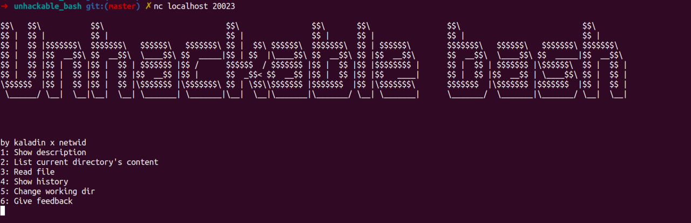
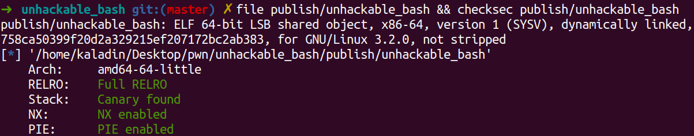
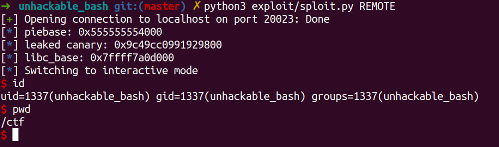

Unhackable bash
===

Главной задачей было симулировать ситуацию наиболее приближенную к реально возможному сценарию: таким образом программа была скомпилирована со всеми основными безопасными флагами (подробнее про это позже) и запущена в изолированном докер-контейнере, с нулевым числом внешних зависимостей.

### Структура проекта

* [`Исходный код`](main.c) программы, которая запущена на удалённом сервере
* [`Эксплойт`](exploit/sploit.py)
* [`Описание используемых уязвимостей`](exploit/README.md)

### Сборка

Для сборки и деплоя используется система сборки [`PwnableHarness
`](https://github.com/C0deH4cker/PwnableHarness). После установки необходимых зависимостей, можно скомпилировать проект и поднять докер-контейнер с приложением одной командой

```bash
pwnmake publish
```

### Исходная программма

Само приложение представляет из себя довольно простую консольную утилиту, которая способна выполнять некоторые команды с файловой системой



Команда для компиляции
```bash
gcc -m64 -I. -O0  -fPIC -DNDEBUG=1 -MD -MP -MF src/*.c.d -c -o src/*.c.o src/*.c
gcc -m64 -Wl,-z,relro,-z,now -pie -o unhackable_bash src/*.o
```

В итоге получаем 64-битный ELF для x86 с полным набором ограничений для безопасного исполнения



### Эксплойт

Результатом выполнения эксплойта является доступ к шеллу на удалённой машине

